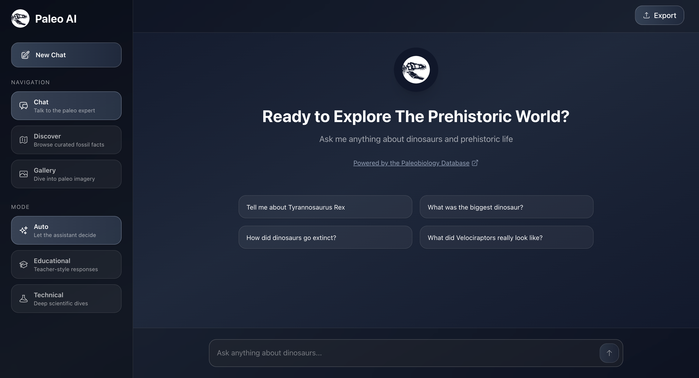

# 🦖 Paleo AI - Interactive Paleontology Knowledge Platform

An AI-powered web application that makes paleontology accessible to everyone through conversational AI, interactive visualizations, and real-time fossil data from the Paleobiology Database.

The app is live [here](https://dino-chat-beta.vercel.app/)

 

## 🌟 Features

### 💬 Intelligent Chat Interface
- **Dual-mode AI responses**: Automatically switches between educational (beginner-friendly) and technical (scientific) explanations
- **Entity recognition**: Automatically detects dinosaur names and fetches verified data
- **Rich formatting**: Markdown support with syntax highlighting for scientific terms
- **Real-time PaleoDB integration**: Displays taxonomic classification, geological periods, and fossil locations

### 🗺️ Discover Dashboard
- **Dashboard visualization mode**: Dashboard visualization of fossil occurences

### 🖼️ Image Gallery
- **Wikimedia Commons integration**: Search millions of paleontology images
- **Lightbox viewer**: Full-screen image viewing with metadata
- **Automated search**: Seamlessly integrated with chat for visual learning

## 🛠️ Tech Stack

### Frontend
- **Next.js 14** (App Router) - React framework with server-side rendering
- **React 18** - Component-based UI with hooks
- **Tailwind CSS** - Utility-first styling
- **ReactMarkdown** - Rich text formatting

### Backend & APIs
- **Next.js API Routes** - Serverless backend
- **Google Gemini AI** - Large language model for natural conversations
- **Paleobiology Database API** - 400,000+ fossil records
- **Wikimedia Commons API** - Educational imagery

### Data Visualization
- **Dynamic filtering** - Real-time data aggregation

### Development Tools
- **Axios** - HTTP client for API requests
- **Heroicons** - Beautiful icon library
- **ESLint** - Code quality enforcement

## 🚀 Getting Started

### Prerequisites
- Node.js 18+ and npm
- Google Gemini API key ([Get one free](https://aistudio.google.com/apikey))

### Installation

1. **Clone the repository**
   ```bash
   git clone https://github.com/yourusername/paleo-ai.git
   cd paleo-ai
   ```

2. **Install dependencies**
   ```bash
   npm install
   ```

3. **Set up environment variables**
   
   Create a `.env.local` file in the root directory:
   ```env
   GEMINI_API_KEY=your_gemini_api_key_here
   ```

4. **Run the development server**
   ```bash
   npm run dev
   ```

5. **Open your browser**
   
   Navigate to [http://localhost:3000](http://localhost:3000)

## 📁 Project Structure

```
paleo-ai/
├── app/
│   ├── page.js                      # Main UI with tabs (Chat, Discover, Gallery)
│   ├── layout.js                    # Root layout
│   ├── globals.css                  # Global styles
│   └── api/
│       ├── chat/route.js            # AI chat endpoint
│       ├── discover/route.js        # Fossil occurrence data
│       └── search-images/route.js   # Image search
├── components/
│   ├── ChatMessage.js               # Message rendering with Markdown
│   ├── DiscoverDashboard.js         # Fossil occurences dashboard
│   └── ImageLightbox.js             # Image viewer modal
├── lib/
│   ├── gemini.js                    # Gemini AI service wrapper
│   └── paleodb.js                   # PaleoDB API client
├── public/
│   └── images/                      # Static assets
└── package.json
```

## 🎯 Use Cases

### For Students
- Learn about dinosaurs and prehistoric life through conversation
- Analyse fossil distributions across geological time
- Explore taxonomic classifications interactively

### For Educators
- Teach paleontology with engaging AI explanations
- Understand fossil distributions across the world
- Access verified scientific data from PaleoDB

### For Researchers
- Query fossil occurrences by period and location
- Technical mode provides scientific nomenclature
- Direct links to PaleoDB records for citations

## 🧪 Key Features Explained

### AI Mode Detection
The system automatically analyzes user queries and switches between:
- **Educational Mode**: Simplified explanations with analogies
- **Technical Mode**: Scientific terminology and precise data

### PaleoDB Integration
- Real-time queries to the world's largest fossil database
- Taxonomic data: phylum → class → family → genus
- Geological ranges: First and last appearance dates
- Fossil occurrences: GPS coordinates and formations

### Smart Entity Extraction
AI-powered detection of dinosaur names in natural language:
- "Tell me about T-Rex" → Extracts "Tyrannosaurus"
- Handles common names and scientific nomenclature
- Falls back to AI extraction for unknown terms

## 📊 Data Sources

- **[Paleobiology Database](https://paleobiodb.org/)**: 400,000+ fossil occurrences
- **[Wikimedia Commons](https://commons.wikimedia.org/)**: Open-access imagery
- **Google Gemini**: AI language model (Gemini 1.5 Flash)

## 🌐 Deployment

Deployed on Vercel

## 🔮 Future Enhancements

- [ ] Interactive heatmaps based on fossil occurences
- [ ] Switch between Gemini models (currently using gemini-2.5-flash)
- [ ] Timeline slider to animate fossil appearances through geological periods
- [ ] Fossil Image Database mapping 
- [ ] User accounts with favorite dinosaurs
- [ ] Export chat conversations as PDF
- [ ] Comparison tool (e.g., "Compare T-Rex vs Spinosaurus")
- [ ] Voice input for questions


## 📝 License

This project is licensed under the MIT License 

## 🙏 Acknowledgments

- **Paleobiology Database** for providing open access to fossil data
- **Wikimedia Commons** for educational imagery
- **Google** for Gemini AI API
- **Next.js** team for the amazing framework

## 📧 Contact

Hiruni Perera - [@-hiruni-perera](https://www.linkedin.com/in/-hiruni-perera/) - khmp.perera@gmail.com

---

⭐ If you found this project helpful, please give it a star on GitHub!


